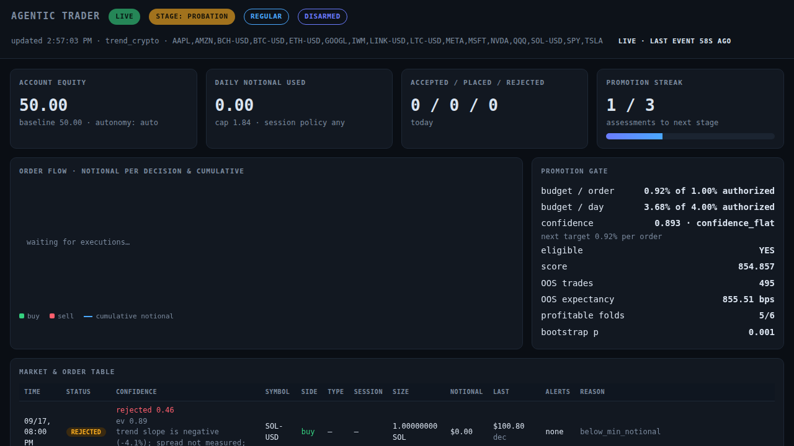
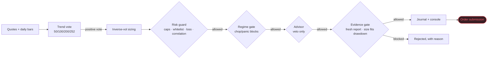

# Agentic Trader

**An autonomous trading agent for Robinhood that has to earn the right to trade — and still asks you before it spends a cent.**

[](https://github.com/Hkshoonya/agentic-trader/actions/workflows/windows-build.yml)
[](#verify)
[](pyproject.toml)
[](windows/README.md)
[](#the-two-switches)
[](LICENSE)



---

## What this is

A self-hosted trading agent that reads Robinhood's Trading MCP for quotes and
history, decides with a fixed, pre-registered trend rule, sizes positions from
its own measured evidence, and refuses to trade when the evidence, the regime or
the risk budget says no. It runs 24/7 (crypto included), keeps a full journal of
every decision, grades each one, and promotes or demotes itself as the evidence
changes.

## What this is not

- **Not a guaranteed money-maker.** The honest measured result on 11 years of the
  current 16-symbol universe is a thin edge: **+856 bps expectancy per trade**,
  495 trades, 5 of 6 walk-forward folds positive, p = 0.0005 — and at a
  drawdown-compliant size that is roughly **$2/year on a $50 account**. Sized
  larger, the same rule carries a ~30% drawdown. Both numbers are on the console.
- **Not financial advice**, not a signal service, and not something to run with
  money you cannot afford to lose.
- **Not agentic in the "does whatever it likes" sense.** The LLM in this system
  can only ever *refuse* a trade. It cannot invent one, size one, or extend a
  hold.

## 60-second overview

```text
quotes ─► strategy ─► risk guard ─► gates ─► journal ─► console (read-only)
                                       │
                                       └─► order submission  ◄── you arm this
```

1. **Strategy** — a fixed multi-horizon trend rule (50/100/200/252-bar votes),
   rebalanced once per UTC day, sized inversely to volatility.
2. **Risk guard** — per-order and daily notional caps, symbol whitelist, daily
   loss limit, correlation clusters, kill switch.
3. **Gates** — an LLM regime read (chop/panic blocks entries), an advisory veto,
   and the evidence gate: a walk-forward report that must be fresh, and a book
   that must fit inside the size its drawdown allows.
4. **Journal** — every decision, accepted or rejected, with the reason and a
   confidence grade for that specific order.
5. **Console** — a read-only local dashboard: order table, live stream,
   candidates, promotion gate, evidence, back-checks.
6. **Order submission** — the only path to real money, and it is off until you
   turn it on.

## Quick start

### Linux / macOS

```bash
git clone https://github.com/Hkshoonya/agentic-trader.git
cd agentic-trader
python3 -m venv .venv && .venv/bin/pip install -e ".[dev]"
cp config/agentic.example.toml config/agentic.toml     # edit paths and caps
.venv/bin/agentic-trading auth    --config config/agentic.toml   # Robinhood OAuth
.venv/bin/agentic-trading run     --config config/agentic.toml   # shadow, no orders
.venv/bin/agentic-trading dashboard --config config/agentic.toml --open
```

### Windows (one click)

Download `AgenticTrader-windows-x64.zip` from the latest
[Actions run](https://github.com/Hkshoonya/agentic-trader/actions/workflows/windows-build.yml),
unzip anywhere writable, and run `AgenticTrader.exe`. It seeds its own workspace
at `%LOCALAPPDATA%\AgenticTrader` and starts in shadow mode. Build it yourself
with `windows\build.ps1` — see [windows/README.md](windows/README.md).

### Try it without any credentials

```bash
.venv/bin/python -m pytest tests -q                     # 629 tests
.venv/bin/agentic-trading selfcheck --offline --config config/agentic.example.toml
.venv/bin/python paper_scalper.py --quotes data/spy_quotes.jsonl --config config.json --output results
```

`paper_scalper.py` is a separate, fully offline simulation over recorded SPY
quotes: no network, no credentials, no broker.

## <a name="the-two-switches"></a>The two switches

Nothing else decides how much the agent may do on its own.

| Switch | Default | What it allows | Where |
|---|---|---|---|
| Autonomy | **off** | the agent may promote/demote its own stage as evidence changes | `AGENTIC_ALLOW_AUTONOMY=1` |
| Arm | **off** | real orders may be submitted to the broker | `AGENTIC_ALLOW_LIVE=1` (Windows app: type `ARM`) |

Both are session environment, not configuration files, so a copy of this repo on
someone else's machine starts inert whatever the state files say. A promoted but
unarmed agent journals `live_gate_blocked` with the order it *would* have sent.

## How positions are sized

Two things decide the dollars in an order: the operator's ceiling, and the
strategy's own inverse-volatility weight.

The rule computes a weight per symbol — `min(1.5, 20% / σ)` — so a 9%-vol ETF
weighs `1.50` and a 60%-vol pair weighs `0.33`. With `sizing = "proportional"`
the per-order budget is scaled by that weight (capped at 1.0, so a quiet asset
never exceeds your ceiling); with `sizing = "flat"` every entry gets the same
dollars and the weight only decides *which* symbols get slots.

That difference is not cosmetic. Same rule, same 495 trades, same +856 bps per
trade, measured on 11 years of the current universe:

| sizing | per order | max drawdown | $50 → |
|---|---|---|---|
| flat | 0.92% | 13.0% | $72 |
| **proportional** | 0.92% | **4.1%** | $58 |
| flat | 2.04% | 23.9% | $106 |
| **proportional** | 2.04% | **9.0%** | $67 |

Flat sizing hands a 60%-vol pair the same dollars as a 14%-vol ETF, so the risk
concentrates in exactly the instruments the weighting meant to hold back. The
proportional book gives up some upside (fewer dollars in the wild names) and
takes roughly a third of the drawdown for it — which is why it is what the
shipped Windows template uses.

```
sizing = "proportional"   # or "flat" for the older behaviour
```

## Trading a small account

There is a third decision, and it is the one a $50 account runs into on day one:
**the evidence-compliant order can be smaller than the broker's minimum.**
Robinhood will not take an order below $1.00, and 1% of $50 is $0.46 — so the
agent refuses every entry, correctly, and does nothing at all.

`small_account_max_order_pct` is the operator's answer to that. Set it above zero
and, while the account is too small to place an evidence-compliant order, the
per-order cap is raised to *just* enough to place one order — never above your
number — and released automatically the moment the account can stand on its own:

```toml
min_order_notional = "1.00"
small_account_max_order_pct = "0.025"   # 0 = refuse rather than size up
```

What that actually does on $50, from the live journal:

```text
small_account_mode  engaged=true  sufficient=true
  policy_max_order_pct = 0.01  ->  effective 0.0204
  $1.00 minimum + rounding margin / $50 = 2.04%
```

The console says what that size costs, from the evidence report's own size
frontier (`/api/summary` → `risk.drawdown_at_effective_pct`). Measured on the
current 16-symbol universe with **proportional sizing**:

| per order | max drawdown | $50 → | inside the 15% gate |
|---|---|---|---|
| 0.50% | 2.2% | $54 | yes |
| 0.92% (evidence size) | 4.1% | $58 | yes |
| **2.04%** (small-account mode) | **8.8%** | $67 | **yes** |
| 3.00% | 13.1% | $77 | yes |

The daily notional ceiling still applies, and on $50 it binds first: 3.68% of $50
is $1.84, so **one $1.02 entry a day**, not four. Small-account mode buys you a
seat at the table; it does not buy you more bets.

With the rule off (`0`, the default in `config/agentic.example.toml`) nothing
changes: entries are refused with `below_min_notional` until the account grows
past the point where the evidence-compliant size clears the minimum (~$110 at a
1% ceiling).

## Models: what each one is allowed to do

The system uses models for *judgment*, never for creation. Both backends below
can only refuse an entry; neither can invent a trade, size one, or extend a
hold.

| Role | Default | Alternative |
|---|---|---|
| Entry veto + regime read | any OpenAI-compatible chat model (`AGENTIC_LLM_API_KEY`) | **TypeSafe Jev** (below) |

### TypeSafe Jev for the regime read

Jev returns *typed judgments* — a choice, a probability per option, and a
confidence — rather than prose. That makes it a better fit for the regime gate
than a chat model, and cheaper: the gate asks one question per symbol, and Jev
answers all of them **in a single call**, so the whole 16-symbol book is
classified with a probability for every regime instead of one parsed label per
round trip.

Put both lines in `.env` (the daemon loads it) or export them in the shell:

```bash
TYPESAFE_API_KEY=...        # console.typesafe.ai/settings/keys
AGENTIC_REGIME_BACKEND=jev  # default: the chat model
```

Then confirm it, with a command that touches nothing:

```console
$ agentic-trading llm-check
OK              chat model (entry veto + regime): deepseek-flash in 1.86s · said: 'OK'
OK              TypeSafe Jev (regime classifier): jev-latest in 1.45s · SPY trend_up 0.99
```

It exits non-zero if a *configured* backend fails, prints `NOT CONFIGURED` with
the fix when a key is missing, and never prints a key. `TYPESAFE_AI_API_KEY`,
`TYPESAFE_KEY` and `JEV_API_KEY` are accepted as aliases, and
`AGENTIC_LLM_REGIME_BACKEND` is accepted as a spelling of the switch — a key was
pasted into the wrong variable once, and a name should not decide whether the
agent can see its own credentials.

Optional: `TYPESAFE_BASE_URL`, `TYPESAFE_MODEL` (default `jev-latest`).

What changes, concretely:

- one request per refresh instead of one per symbol: measured live on this
  book, **all 16 symbols in one call, 1.85 s**, against 368 chat-model calls on
  a quiet day;
- every view carries its distribution, so the console can show
  `chop 0.65, trend_down 0.20, trend_up 0.10, panic 0.05` instead of a label;
- the same rule as before still decides: a regime blocks entries only when the
  model is at least `block_confidence` (0.60) sure, and low confidence means the
  gate stands aside rather than guessing;
- if the key is missing the daemon logs that it is falling back to the chat
  model, rather than silently using a different model's judgments.

On Windows, paste the key into **API key…** in the launcher and it writes both
variables for you.

## The console



Read-only, stdlib-only, bound to `127.0.0.1`. It shows the order table with a
confidence grade per order, what the rule wants to hold right now and what is
blocking each name, the promotion gate's unmet requirements, the walk-forward
evidence the current size is justified by, and a pulse badge that says
`AGENT SILENT 47m` if the daemon ever stops sending events.

## How it decides



Every arrow can only *remove* a trade. There is no path by which a gate, the
model, or the dashboard creates one.

## Repo layout

```
src/agentic_trading/     the agent: runtime, risk, gates, strategies, console
  runtime.py             the loop, the journal, self-evaluation, self-promotion
  walkforward.py         the evidence rig: one fixed rule, out-of-sample folds
  evidence.py            turns that into a report the console and gate read
  confidence.py          per-order confidence, reporting only
  llm/                   advisor + regime gate (both may only reduce risk)
  rh_mcp/                Robinhood MCP client and OAuth
windows/                 the one-click Windows app (launcher, spec, build)
paper_scalper.py         offline SPY simulation, no network
tests/                   629 tests, including the honesty tests for the rig
```

## Operations

```bash
systemctl --user status agentic-trading             # or: agentic-trading status
agentic-trading selfcheck --config config/agentic.toml   # six back-checks
agentic-trading walkforward --config config/agentic.toml # re-price the rule
agentic-trading evolve --config config/agentic.toml      # search + assess
```

The daemon rebuilds its own evidence report when it is older than
`evidence_refresh_days`, survives a network outage with backoff instead of
crashing, and alerts the desktop if it stops for good. See
[When the agent stops](#when-the-agent-stops).

## Contributing, security, licence

- **Security**: see [SECURITY.md](SECURITY.md). This repository is public; no
  credentials, tokens, journals or live state are ever committed.
- **Contributing**: see [CONTRIBUTING.md](CONTRIBUTING.md). `master` is
  protected — changes arrive by pull request, and a review is required.
- **Licence**: proprietary, all rights reserved — see [LICENSE](LICENSE).

---

## Deep dive

The sections below are the original engineering notes: every phase, every gate,
the exact order-construction rules, the arithmetic behind the risk budget, and
the parts that are still unverified.

## Phase 0 — Agentic shadow foundation

Phase 0 adds a shadow-first Robinhood MCP agent: quotes → strategy → risk guard → decision journal. **Default mode is shadow** — orders are reviewed and logged but never placed. Live placement requires an explicit mode flip and environment gate (see below).

### Install (venv recommended)

On many Linux distros, PEP 668 blocks system-wide `pip install`. Use a virtual environment:

```bash
python3 -m venv .venv
.venv/bin/pip install -e ".[dev]"
```

This installs the `agentic-trading` CLI and dev test dependencies.

### Configure

```bash
cp config/agentic.example.toml config/agentic.toml
```

Edit paths, symbol whitelist, and risk limits as needed. Tokens are stored outside the repo (see `token_path` in the config).

### Shadow run (offline or with Fake MCP)

Uses the recorded quote file by default. Without OAuth tokens, the runtime falls back to a local Fake MCP client (CI-safe):

```bash
agentic-trading run --config config/agentic.toml
# equivalent:
python -m agentic_trading run --config config/agentic.toml
```

Check mode, kill switch, and daily notional:

```bash
agentic-trading status --config config/agentic.toml
```

### Real Robinhood MCP (desktop OAuth)

For authenticated MCP (equity review, account read, and optional live placement):

1. Follow the operator checklist: [`docs/superpowers/plans/manual-oauth-checklist.md`](docs/superpowers/plans/manual-oauth-checklist.md)
2. **Auth:** `agentic-trading auth --config config/agentic.toml`
3. **Snapshot tools:** `agentic-trading snapshot-tools --config config/agentic.toml`

Then run shadow as above; with valid tokens the broker uses the real MCP endpoint instead of Fake MCP.

### Live mode (two gates)

Shadow is the safe default. **Live order placement requires both:**

1. `agentic-trading flip-mode live --config config/agentic.toml`
2. `AGENTIC_ALLOW_LIVE=1` in the environment when running

Revert to shadow with `agentic-trading flip-mode shadow --config config/agentic.toml`.

### Risk disclosure

Agentic trading can lose money. Past simulation or shadow results do not predict live performance. This software is for research and operator-controlled experimentation — **not financial advice**. Understand Robinhood fees, market hours, and order types before enabling live mode.

### Verify Phase 0

```bash
.venv/bin/python -m pytest tests/ -v
```

## Phase 1 — SPY scalper strategy (shadow)

Phase 1 wires the paper SPY scalper rules as a streaming runtime strategy (`SpyScalperStrategy`). It emits `OrderIntent`s into RiskGuard + the decision journal. **Shadow remains the default** — the strategy never places live orders unless both live gates are set (below).

There is **no profit guarantee**. Past paper or shadow results do not predict live performance. The Agentic account can lose all funds.

### Select the strategy

In `config/agentic.toml` (copied from the example):

```toml
strategy = "spy_scalper"
scalper_config = "config.json"  # optional; paper_scalper knobs
```

Or override on the CLI (config default remains `fixture`):

```bash
agentic-trading run --config config/agentic.toml --strategy spy_scalper
```

Offline paper replay is unchanged:

```bash
python3 paper_scalper.py --quotes data/spy_quotes.jsonl --config config.json --output results
```

### Live dual-gate warning

Live placement still requires **all** of:

1. `agentic-trading flip-mode live --config config/agentic.toml`
2. `AGENTIC_ALLOW_LIVE=1` in the environment
3. Valid OAuth tokens (`agentic-trading auth`)

Never set `AGENTIC_ALLOW_LIVE` for routine soaks. Operator checklist: [`docs/superpowers/plans/manual-live-flip-checklist.md`](docs/superpowers/plans/manual-live-flip-checklist.md).

### Verify Phase 1

```bash
.venv/bin/python -m pytest tests/ -v
```

## Phase 2 — Multi-asset LLM strategy (shadow)

Phase 2 adds `LlmMultiAssetStrategy`: an LLM proposes 0..1 `OrderIntent`s from brief quote context. **RiskGuard remains mandatory** on every intent. **Shadow remains the default** — the strategy never places live orders unless both live gates are set.

There is **no profit guarantee**. LLM proposals are research heuristics, not advice. Past shadow results do not predict live performance. The Agentic account can lose all funds.

### Select the strategy

In `config/agentic.toml`:

```toml
strategy = "llm"
# Expand whitelist via config; RiskGuard still rejects non-whitelisted symbols
# symbol_whitelist = ["SPY", "QQQ", "IWM"]
```

Or override on the CLI:

```bash
agentic-trading run --config config/agentic.toml --strategy llm
```

### LLM client (Fake by default)

Without `AGENTIC_LLM_API_KEY`, the CLI uses `FakeLlmClient` (empty intents by default) and prints a warning — **CI-safe; no real LLM HTTP**.

Optional OpenAI-compatible HTTP when configured:

| Env var | Role | Default |
|---|---|---|
| `AGENTIC_LLM_API_KEY` | Bearer token (required for real HTTP) | unset → Fake |
| `AGENTIC_LLM_BASE_URL` | API base URL | `https://api.openai.com/v1` |
| `AGENTIC_LLM_MODEL` | Model name | `gpt-4o-mini` |

### Live dual-gate warning

Same as Phase 0/1: live placement still requires `flip-mode live`, `AGENTIC_ALLOW_LIVE=1`, and valid OAuth. Never set `AGENTIC_ALLOW_LIVE` for routine soaks.

### Verify Phase 2

```bash
.venv/bin/python -m pytest tests/ -v
```

## Phase 3 — autonomous live loop

Phase 3 turns the shadow foundation into a loop that can run unattended against
a live feed, with the order path built to the **actual** MCP schema (verified
2026-09-16). It also fixes three integration breaks that would have failed on
the first authenticated run: the broker called a non-existent `get_account`
tool, no `account_number` was ever sent, and live orders carried parameters the
place tool rejects.

### What the daemon does each cycle

1. Checks the US equity session (America/New_York) against `session_policy`
2. Refreshes account equity from `get_portfolio` (throttled by `equity_refresh_seconds`)
3. Reads open orders and blocks new entries for symbols with a pending order
4. Polls quotes (`quote_source = "mcp"` → `get_equity_quotes`, or `"file"` → tails a collector JSONL)
5. Runs the strategy → RiskGuard → `review_equity_order` → journal
6. If (and only if) every gate passes: `place_equity_order` with `ref_id = decision_id`, then journals the result

### Commands

```bash
# Read-only: which account would the bot trade?
agentic-trading accounts --config config/agentic.toml

# Read-only: dump raw account/quote payloads to confirm parser shapes
agentic-trading probe --config config/agentic.toml

# One autonomous cycle (best first live smoke test; --dry-run forces shadow)
agentic-trading run --config config/agentic.toml --daemon --once --dry-run

# Unattended loop
agentic-trading run --config config/agentic.toml --daemon
```

`--dry-run` forces shadow mode even when `state_dir/mode` says live. `probe`
writes `state_dir/probe.json`, which contains account data and is gitignored.

### Live gates (all four required)

1. `agentic-trading flip-mode live --config config/agentic.toml`
2. `AGENTIC_ALLOW_LIVE=1` in the environment
3. Current session permitted by `session_policy` (default `regular`)
4. RiskGuard allows the intent, and a review call precedes every placement

### Order construction rules (encoded, not assumed)

| Situation | What is sent |
|---|---|
| Buy, regular hours, `order_type = "market"` | dollar-based market order (the only fractional path) |
| Sell, regular hours | exact held quantity, market order |
| `order_type = "limit"`, or any non-regular session | marketable limit at the touch, whole shares only |
| Fractional quantity outside regular hours | refused locally (`order_invalid`) — the position could not be exited |

### Hard limits in the autonomous loop

- `max_orders_per_day` entries per local day, plus the notional caps in RiskGuard
- `max_consecutive_errors` broker placement failures trip the kill switch
- Stale or future-dated quotes are refused before a strategy or LLM sees them
- An open order for a symbol blocks another entry in that symbol
- Kill switch and daily counters survive restarts via `state_dir/risk_guard.json`

### Crypto (24/7) — a separate broker namespace

Robinhood's crypto tools are not the equity tools with a different symbol. They
want the numeric `rhs_account_number` (not the alphanumeric `account_number`),
reject `market_hours` outright, spell a stop-triggered market order `stop_loss`,
and accept only `gtc`-or-omitted for market/limit durations. Sending an equity
argument shape to a crypto tool (or the reverse) fails with `unexpected
additional properties`, which is what `broker.review_order`/`place_order` route
around by symbol, and what `tests/test_crypto_routing.py` pins against the
recorded tool schemas.

Two consequences worth knowing before enabling anything:

- **Holdings live in two books.** `get_equity_positions` cannot see crypto, so
  the live loop merges `get_crypto_positions` and `get_crypto_orders` before it
  asks RiskGuard. Without that merge a live crypto position is invisible: entries
  would stack past `max_open_positions` and an exit would be refused as
  `would_short`, stranding the position. If the crypto book cannot be read while
  the whitelist trades pairs, the merged snapshot fails closed.
- **Crypto goes live later than equities.** It has no closing bell to flatten
  into, so it only submits at `stage = "live"` — not at `probation`, and not
  while the promotion gate still reports `eligible: false`. Below that it is
  simulated and journaled as `place_refused` with reason
  `crypto_requires_live_stage`.

### Operator services

Both halves run as `systemd --user` units that restart on failure and at boot:

```bash
systemctl --user status  agentic-trading agentic-trading-dashboard
systemctl --user restart agentic-trading            # daemon (trading loop)
systemctl --user restart agentic-trading-dashboard  # console on 127.0.0.1:8787
journalctl --user -u agentic-trading -f             # live log
```

The console is read-only, binds to loopback, and re-reads `config/agentic.toml`
on every request, so editing the strategy or whitelist does not require a
restart (and cannot silently misreport what the daemon is doing).

### Self-promotion vs. arming: two different switches

The agent can promote itself, and that is now on (`autonomy = "auto"` plus
`AGENTIC_ALLOW_AUTONOMY=1` in the unit). Once the evidence gate passes three
consecutive assessments it moves itself shadow → probation → live with no
operator action.

Submitting a real order is a *separate* switch, `AGENTIC_ALLOW_LIVE=1`, and it
is deliberately unset. So there are three states, and the console badge tells
them apart:

| State | Meaning | How it reads |
|---|---|---|
| `shadow` | evidence gate has not passed | `stage: shadow`, `disarmed` |
| live + `disarmed` | gate passed, nobody armed submission | `LIVE`, `disarmed`, journal `live_gate_blocked` |
| live + `LIVE ARMED` | gate passed and the operator armed it | `LIVE`, `LIVE ARMED`; orders are submitted |

The daemon publishes what it actually sees to `state_dir/live_gate.json` (the
console runs in its own process and cannot read the daemon's environment), and
journals a `live_gate` record at startup and on every stage change. When a
decision is ready and only arming is missing it journals `live_gate_blocked`
instead of looking like a normal shadow cycle.

Crypto is stricter than equities: it only submits at `stage = "live"`, never at
`probation`, because it has no closing bell to flatten into.

### How fast this can actually go

Measured against the live gateway on 2026-09-16 (read-only calls):

| Operation | Measured |
|---|---|
| one MCP round trip (quotes, account, review) | ~1.3 s |
| one full loop cycle (quote poll + order read) | 7.9 s of work, ~10 s with the default poll |
| LLM advisor decision (DeepSeek `deepseek-flash`) | 3.7 s |
| full entry path once a signal fires | ~6-8 s |

Every decision is one more round trip, so this is a seconds-scale system, not a
high-frequency one: there is no colocated execution, no order-book feed, and no
way to beat a 1.3 s API round trip. What it can do is decide continuously
(`cycle_stats` heartbeat in the journal reports the measured cadence), trade the
24/7 crypto book around the clock, and size up as equity grows.

Levers, in order of effect: `open_order_refresh_seconds` (each poll skipped is
two round trips), `poll_seconds`, and how often the LLM advisor sits in the
decision path.

### The risk budget moves with confidence

The configured percentages are a **ceiling**, not a setting the agent spends by
default. Every assessment grades the evidence on a 0..1 confidence scale and the
agent's own budget moves between 25% of that ceiling and 100% of it:

| | value |
|---|---|
| `config.max_order_pct` / `daily_notional_pct` | the ceiling — never exceeded |
| floor | 25% of the ceiling (still trades, just smaller) |
| growth step | +25% per assessment, never past what confidence justifies |
| cut step | −50% per assessment |
| growth needs | confidence not deteriorating since the last assessment |
| kill switch / demotion | straight to the floor; confidence must be rebuilt |

Confidence is graded from the same evidence the promotion gate uses, and every
component is journaled so a size change can always be traced to the number that
moved it:

`significance` (bootstrap p vs 0.05) · `sample` (OOS trades vs 30) ·
`expectancy` (bps vs 25) · `folds` (positive fraction) · `drawdown` (headroom
under the cap) · `stability` (profit factor vs 1.5), weighted 35/20/20/10/10/5.

This runs live: the first graded assessment scored **0.525** and moved the real
budget from 2.5% → **3.125% per order** and 10% → **12.5% per day**, with
3.22%/order queued as the next step toward the 5%/20% ceiling.

`max_session_policy` is the same idea applied to trading hours: the agent may
widen one step per assessment toward that bound (and never narrow below
`session_policy`), but only above 0.75 confidence. With `session_policy = "any"`
the bound is already the widest, so that lever is inert today.

### Confidence in the order table

Every row in **Market & order table** shows the two confidences that produced it:

- **ai x.xx** — the model's own confidence in that specific order, coloured by
  whether it allowed or vetoed. Sources from the `advisor` journal record.
- **ev x.xx** — the system-wide evidence grade in force when the decision was
  taken, i.e. the number the risk budget was sized from.

They answer different questions ("does this order look sane" vs "does the edge
look real") and are deliberately not averaged. A row rejected mechanically —
`max_open_positions`, `over_daily_notional`, `kill_switch` — still shows both, so
the table explains *why* it was refused, not just that it was.

### What the LLM is actually allowed to do

Every model capability here is bounded to **reducing** risk. A model cannot be
backtested the way a genome can, so it never creates a trade, never sizes one,
never extends a hold, and never touches RiskGuard. Within that line it now does
three jobs:

| job | direction | where it runs |
|---|---|---|
| entry veto (`advisor`) | may refuse an entry | order path, one call per entry |
| regime gate (`regime`) | may block entries in chop/panic | off-path worker, cached 15 min |
| hold opinion | recorded only, never acted on | order path, same call as the veto |

**Grounding.** The advisor used to be shown a price and a quantity, which makes
a veto a coin flip dressed as judgment. Both prompts now carry locally computed
tape features — `return_1bar/5bar/20bar_pct`, `realized_vol_per_bar_pct`,
`trend_slope_20bar_pct`, `below_recent_high_pct`, `range_position_0low_1high`,
and the live `spread_bps` — from the same bars the backtests use. Its reasons
changed from "no trap signals, small size" to "counter-trend long bounce within
a 20-bar downtrend (slope -4.55%, 20-bar return -9.80%); high overnight
volatility raises trap risk", which is the difference between a vibe and a
judgment.

**The regime gate** classifies each whitelisted symbol as `trend_up`,
`trend_down`, `chop` or `panic`. Only `chop`/`panic` at ≥0.60 confidence do
anything, and all they do is refuse entries (`regime_block` in the journal, and
the row shows up in the order table). A `trend_up` never creates a trade: the
mechanical strategy still has to signal, and RiskGuard still has to allow.

Two properties make it safe to leave running:

- **Never on the critical path.** Classifications are cached per symbol and
  refreshed by a background worker (`regime_refresh_seconds`, default 180s, two
  symbols per pass). An entry reads the cache and never waits on a model call.
- **Failure means "no opinion".** A missing key, a timeout, or unparseable JSON
  allows trading exactly as before, and journals `regime_failed`. The gate can
  only ever subtract.

**Burst control.** The advisor sits in the decision path, so a burst of signals
used to cost one ~4s model call each. Two bounds now apply:

- a **situation cache** (5 min) keyed on symbol + side + coarse market state
  (trend bucket, range position, volatility, spread). The same question asked
  again reuses the verdict and journals `reused: true`. The key is deliberately
  coarse: the bucket has to be stable across a few seconds of tape movement, or
  it would never match.
- a **per-minute budget** (20 calls, `AGENTIC_ADVISOR_MAX_CALLS_PER_MINUTE`).
  Past it the advisor degrades to "no opinion" and journals `advisor_budget`
  rather than stalling the loop behind a queue of model calls. The veto is an
  optional filter; RiskGuard, the regime gate and the correlation limit still
  apply.

Measured live: calls arrive per symbol and mostly distinct — 4 calls in 5
minutes across BCH/BTC/ETH/LINK, all vetoes — so the cache correctly does not
fire yet. It is insurance against the burst shape, not a claim of savings today.

Retired on purpose, and still refused: letting the model search for strategies
(that is what the evolution engine and the search-corrected significance bar are
for — a model generating hypotheses would silently multiply the comparisons and
manufacture false positives), and letting it extend a hold past a mechanical
exit.

### What survives a restart

The daemon is expected to be killed and restarted (`Restart=always`, reboots,
deploys). Everything it has learned lives on disk, and a restart is checked
against that promise rather than assumed:

| state | file | survives |
|---|---|---|
| stage, streak, last assessment | `state_dir/promotion.json` | yes |
| risk budget, confidence, session policy | `state_dir/effective_limits.json` | yes |
| kill switch, day P&L, daily notional | `state_dir/risk_guard.json` | yes |
| shadow book (rebuilt from today's journal) | `journal_dir/<date>.jsonl` | yes |
| orders used today (counted from the journal) | `journal_dir/<date>.jsonl` | yes |
| LLM regime classifications | `state_dir/regimes.json` | yes — otherwise the gate goes deaf until the worker catches up |
| arming state, autonomy state | `state_dir/live_gate.json` | yes |
| per-worker roster for the console | `state_dir/agents.json` | rewritten on start |

State files are written atomically (`jsonio.write_text`), because a torn read of
`effective_limits.json` used to parse as "no limits stored" and silently restore
the full ceiling. A corrupt or unreadable file is treated as "no opinion", never
as a reason to crash.

Verified by restarting the live daemon mid-session: stage, streak, mode, budget,
confidence, daily notional, equity, kill switch, accepted-order count and the
journal were all intact, and two regime classifications came back from disk.

**The strategy's own book was the exception, and it was the dangerous one.** A
deliberate audit of a quiet overnight run found three defects in
`strategies/trend_crypto.py`:

- it recorded a position the moment it *emitted* an entry intent, so a vetoed or
  capped entry still marked the symbol as held ("phantom" positions);
- fills were keyed `BTC-USD` while lookups used `BTCUSD`, so the exit quantity
  always read `0` and **the strategy could never close a position**;
- holdings and the once-per-day rebalance guard lived in memory, so every
  restart re-ran that day's rebalance and forgot what was open.

Holdings are now derived from a ledger that only a reported fill changes, keyed
the way the bar files are, persisted to `state_dir/strategy_trend_crypto.json`,
and reconciled at start-up against the runtime's view — plus a replay of recent
`accepted` records, because the runtime's own shadow book is day-scoped and
legitimately forgets yesterday. An empty runtime view is treated as "no
information", never as "you hold nothing".

### Alerts, and the roster on the console

Unattended means the events that change the risk posture have to reach you
instead of waiting to be noticed on a dashboard tab. `notify.py` alerts on:

| event | urgency | cooldown |
|---|---|---|
| `promotion` (stage changed) | normal | none |
| `promotion_requires_consent` | normal | none |
| `live_gate_blocked` (ready, but not armed) | normal | 1 hour per symbol |
| `kill_switch` tripped | critical | none |
| `demotion` | critical | none |
| `placed` (a real order went out) | normal | none |

Channels: **desktop** (`notify-send`, on by default when present) and
**Telegram** (`AGENTIC_TELEGRAM_BOT_TOKEN` + `AGENTIC_TELEGRAM_CHAT_ID`). Disable
with `AGENTIC_NOTIFY=0`. A failing channel is counted, never fatal: the alert is
swallowed and the loop keeps trading. Kill-switch trips were not even journaled
before this, so nothing could have alerted on them — that gap is closed and the
trip now appears in the journal and the stream.

The console has an **Agents on duty** panel fed by `state_dir/agents.json`, so it
shows the actual workers rather than a drawing of them: `strategy`, `advisor`
(calls/errors), `regime` (views, worker live), `risk guard` (the caps in force),
`evolution` (stage), `notifier` (channels, sent). Recent alerts appear beneath it.

### The evidence has to be able to change

`ev` in the order table is the system-wide evidence grade. Seeing it sit at the
same value across hundreds of rejections is correct — but it exposed a real bug:
nothing was refreshing the bar files, and the search is deterministic, so every
hourly evaluation re-ran the same search over the same frozen data and returned
the same number forever. The risk budget could never move.

Two fixes:

- **History refresh** (`history_refresh_hours`, default 24): the daemon
  re-fetches daily bars — equities through the broker's historicals tool, crypto
  through Coinbase's public candles (Robinhood has no crypto historicals tool at
  all). Fetches are **merged** on bar start time, so a request that returns only
  the recent window extends history instead of truncating it.
- **Skip the search when nothing changed**: re-running a deterministic search
  over identical files cannot produce different evidence, so the daemon
  fingerprints the bar files it would read and journals
  `evaluation_skipped: history_unchanged` instead of burning minutes of CPU. That
  event is the honest answer to "why is confidence not moving".

It also fixes what the search was grading. `run_evolution` used to pool **every**
bar file on disk — 30 symbols — while the agent may only trade the 7 in its
whitelist. Grading an edge on instruments you cannot trade is how a gate promotes
a strategy that cannot run, so the evaluation universe is now the whitelist
(`evolution.json` records it, and the console shows it), falling back to all
files only if none of the whitelist has history.

First run under the honest universe: confidence moved `0.5252 → 0.523`, out-of-
sample trades `23 → 29`, expectancy `125 → 78 bps`, drawdown `7.97% → 13.79%`,
bootstrap p `0.053 → 0.178` — and the risk budget followed it *down*
(`confidence_down`). The old number was partly flattery from symbols the agent
cannot trade.

### Shadow P&L accumulates

`ShadowBook.realized_pnl` is **day-scoped** on purpose — RiskGuard's daily-loss
kill switch needs today's number. But the forward record the strategy is being
judged on was being reset every midnight along with it, and positions were
rebuilt from a single day's journal, so a position opened yesterday simply
vanished from the book at 00:00.

Now there are two figures and two windows:

| | scope | used for |
|---|---|---|
| `realized_pnl` | today | the daily-loss kill switch |
| `realized_total` | since inception | the forward record, shown on the console |

The book is rebuilt from a rolling window (`ShadowBook.from_journal(journal,
days=30)`, `journal.iter_recent`) rather than one file, so holdings and the
running P&L survive midnight, restarts and redeploys. `roll_day()` resets only
the day figure.

Verified live: the day-scoped rebuild of the current journal holds nothing,
while the 30-day rebuild holds the open `BTC-USD` position — the difference
between a book that forgets and one that accumulates.

### The back-check agent

Every failure in this repo so far was found by a human noticing something odd — a
stalled feed that looked like a quiet market, a truncated bar file that looked
like a strategy with no signals, a frozen evidence grade that looked like
patience. `selfcheck.py` runs the things the bot depends on and reports instead:

| check | proves |
|---|---|
| `state` | every state file the loop reads still parses, caps inside their ceiling, confidence a probability |
| `data` | every whitelisted symbol has bars, recent enough to trade, passing the quality gate |
| `analysis` | bars load and a backtest actually runs on them — files existing is not proof |
| `broker` | read-only round trips still work (skipped offline) |
| `plumbing` | journal writable, alert channels resolvable, LLM enabled, console answering |

It runs every `selfcheck_minutes` (default 30) on a worker thread, journals a
`selfcheck` event, writes `state_dir/health.json`, and shows the result in the
console's **Back-check** panel. Run it by hand with
`agentic-trading selfcheck --config config/agentic.toml [--offline]`; the exit
code is non-zero when something is failing. It never repairs anything — a
failure is a finding, and fixing is either the operator's call or the daemon's
existing self-healing.

It earned its keep immediately: its first run failed on `'frozenset' object is
not subscriptable` — a bug in the checker itself, which is exactly the category
of mistake it exists to catch.

### The widened book

The whitelist now carries ten liquid equities (`SPY, QQQ, IWM, AAPL, MSFT, NVDA,
AMZN, GOOGL, META, TSLA`) alongside the six 24/7 crypto pairs, all with five
years of daily history already on disk. Widening is not the same as payoff: the
bot still holds **one** position at a time (`max_open_positions`), so a wider
universe adds opportunity, not exposure, and the re-run under the new universe
did not produce an edge — out-of-sample trades fell to 7, expectancy 240 bps,
max drawdown 2.5%, `p = 0.057` against a Bonferroni bar of `0.000347`, and the
budget was cut again (2.955%/order, confidence 0.4547). The gate still says no.

The broker's equity-only tools (`get_equity_news`, `get_earnings_calendar`,
`get_equity_price_book`, `get_equity_technical_indicators`,
`get_pnl_trade_history`) only become worth wiring now that the equity book is
more than SPY.

### Deploying more than one position: clusters, not names

`max_open_positions` is now **4** (was 1, which left ~3% of the account doing
anything). Position count alone would be a bad limit though: the whitelist holds
six crypto majors that move together and ten liquid equities that do too on a
risk-off day. Four correlated symbols is one bet taken four times.

So the limit is on **correlated clusters**:

| setting | value | meaning |
|---|---|---|
| `max_open_positions` | 4 | ceiling on names, ~12% of equity at the per-order cap |
| `max_correlated_positions` | 2 | at most two positions correlated above the threshold |
| `correlation_threshold` | 0.7 | what counts as the same bet |
| `correlation_lookback_days` | 120 | window for the return correlation |

Correlations are computed from the same bars the evidence uses, refreshed with
the data, and stored in `state_dir/correlations.json`. Live numbers: **QQQ|SPY
0.917**, **BTCUSD|ETHUSD 0.882**, **ETHUSD|SOLUSD 0.842** — 120 pairs in total.
An **unmeasured** pair is treated as perfectly correlated, so the guard never
hands out extra room on the strength of a correlation nobody computed.

The daily notional cap (12.88% of equity) still bounds how fast the book can
fill, so raising the position count changed *which* constraint binds rather than
removing one.

### Are the assumed costs a lie?

The evidence is graded with a cost model of 1 bp half-spread + 1 bp slippage per
side (2 bps per side, 4 bps round trip). That number decides whether a strategy
looks profitable, and it had never been checked against a real fill.

Now it is checked automatically: the daemon pulls the broker's own trade history
(`get_pnl_trade_history`), joins each fill to the price its decision was taken at
(within 30 minutes, from the journal), and reports the all-in per-side cost in
bps against the assumption. Results land in `state_dir/execution_costs.json` and
the journal (`execution_costs`), and once **5+ fills** exist the measured cost
replaces the assumption inside the evolution's `CostModel` — so the gate grades
the strategy on the costs it actually pays.

Current state, honestly: **0 fills, so nothing is measured yet** — the report
says exactly that. The pipeline is built and tested (including sign conventions
for buys and sells, unattributable fills, and a clamp so a single broken print
cannot make execution look free or absurd), and it switches over by itself the
first time the bot trades.

### Known constraints and unverified areas

- **Fractional shares only trade in regular hours as market orders.** At $50,
  one SPY share (~$660) is unaffordable, so `order_type = "market"` is the only
  workable default. Limit orders require whole shares.
- The included `data/spy_quotes.jsonl` is a **premarket** recording, so its
  fractional intents are logged as `order_invalid` — a true finding about that
  strategy/session combination, not a bug.
- `get_portfolio` and `get_equity_quotes` payload shapes are parsed
  conservatively and **fail closed**. Run `probe` with live tokens before the
  first live session to confirm them; unknown shapes stop trading rather than
  guessing at account value.
- In shadow mode the strategy's internal book and the shadow book can diverge
  when an intent is rejected. Only the journal-derived shadow book is
  authoritative for shadow P&L.
- The OAuth endpoints were verified against live discovery metadata
  (`/oauth-authorization-server`, `/oauth-protected-resource`) on 2026-09-16,
  but a full `agentic-trading auth` round trip has not been exercised here.
- No test places a real order; the live path is covered by schema-conformance
  tests against the recorded tool list.

## Run the experiment (paper trading)

## Phase 4 — self-evaluation, self-promotion, and the live console

The agent now tests itself, keeps the evidence, and changes its own trading
stage only when that evidence justifies it. Two new ideas carry the weight:

**1. Honest out-of-sample evaluation.** `evolve` searches strategy genomes on a
training slice of real OHLCV bars, then validates the champion on a slice the
search never saw, charging spread and slippage on both sides of every trade.
Convention details that keep results trustworthy: entries fill at the *next*
bar's open, and when a bar touches both take-profit and stop, the stop is
assumed to fill first.

**2. A promotion gate that refuses.**

| Requirement | Default |
|---|---|
| Out-of-sample trades | ≥ 30 |
| Out-of-sample expectancy after costs | > 1 bps |
| Profitable out-of-sample folds | ≥ 60% |
| Out-of-sample max drawdown | ≤ 15% |
| Bootstrap p-value on trade returns | < 0.05 |
| Consecutive passing assessments per stage | 3 |

Stages are `shadow → probation → live`. Probation trades live at a reduced
per-order cap (`probation_max_order_pct`, default 1%). Demotion back to shadow is
immediate on the kill switch, a broker error streak, or a live drawdown beyond
5% from the equity recorded when the stage began.

### Autonomy levels

| `autonomy` | Behaviour |
|---|---|
| `manual` (default) | the bot never evaluates or promotes itself |
| `assisted` | re-evolves on a schedule and journals a verdict, but never promotes |
| `auto` | may promote/demote itself, **and only when `AGENTIC_ALLOW_AUTONOMY=1`** |

`auto` requires two independent opt-ins: the config value *and* the environment
variable for that session. Without the environment variable the agent still
evaluates, journals `promotion_requires_consent`, and stays in shadow.

### The live console

```bash
agentic-trading dashboard --config config/agentic.toml --open
```

Read-only, stdlib-only, binds to `127.0.0.1`. It auto-refreshes every 2 seconds
and shows: mode/session/kill-switch badges, account equity and daily notional
against the cap, accepted/placed/rejected counters, the promotion streak gauge,
the gate's verdict with every unmet requirement listed, an animated order-flow
chart, the live execution stream, the latest evolution evidence, and the
walk-forward evidence the current order size is justified by.

Each row of the market/order table carries three confidences, because they
answer three different questions: `ev` is the strategy-level evidence grade
(one number for the strategy, and it only moves when the evaluation moves),
`order` is that order's own grade from the tape it was decided on, and `ai` is
the model's opinion when one was consulted.

The `order` grade is graded, per row, in this order of preference:

1. `live` — computed by the runtime at decision time. Every decision from here on.
2. `journal` — rebuilt from the market snapshot the journal recorded *at or
   before* that decision (a snapshot taken eleven hours later describes a
   different market, so it is not used).
3. `bars_asof` — rebuilt from the stored bars cut off at the decision time, for
   decisions older than snapshot recording. Measured against the 82 instants
   where both exist, this lands within 0.016 (median) and 0.038 (worst case) of
   the journaled grade, and the row is marked `as-of` so it is never confused
   with a reading the model actually saw. Where the bars cannot supply one, the
   row stays ungraded and says so.

Rows also show the price they were decided at (`dec`) when no broker quote
exists — a rejected order never reaches the broker's review, and a blank price
hides the only price that row has.

### Typical loop

```bash
agentic-trading auth --config config/agentic.toml
agentic-trading fetch-history --config config/agentic.toml \
    --symbol SPY --start 2025-01-01T00:00:00Z --interval 5minute
agentic-trading evolve --config config/agentic.toml        # verdict + evidence
agentic-trading walkforward --config config/agentic.toml   # what the rule earns, and at what size
agentic-trading dashboard --config config/agentic.toml --open
```

### Walk-forward evidence (`walkforward`)

`evolve` searches genomes and pays the multiple-comparisons price for it, so its
significance bar is nearly unreachable. `walkforward` runs the opposite
experiment: **one fixed rule**, the same one the daemon trades, for which the
bar is a plain `p < 0.05`.

It prices three things on the bars in `history_path`:

- `production` — the rule at the size the confidence ladder would trade today.
- `inverse_vol` — the strategy's own specification: each slot sized to carry the
  same risk (`notional = per_order_pct / sigma`) instead of the same dollars,
  never rescaled to fill the budget.
- `gate_size` — the largest flat size whose out-of-sample drawdown still fits
  inside the 15% ceiling, selected on the same sample and therefore reported as
  a *ceiling on size*, not as evidence of a larger edge.

Drawdown is measured on the marked-to-market account, so a position that is
30% under water shows up before it is sold. The result is written to
`data/state/strategy_evidence.json`, shown on the console, and checked by the
back-check agent: if the live per-order size is larger than `gate_size`, the
`evidence` check fails.

The report does not depend on anyone remembering to run it. The daemon rebuilds
it in its evaluation worker whenever it is older than `evidence_refresh_days`
(default 7 days, `0` disables), off freshly synced bars, and journals
`evidence_refreshed` with the headline numbers. That matters because the
promotion gate refuses a stale report — without the automatic rebuild, "the bot
earns its own promotion" would quietly become "the bot stalls in a month".

Promotion itself is applied on every path that can reach it: the stage (which
the evidence decides) raises the run mode, the mode file records it for the next
restart, and the console journals `stage_applied` / `autonomy_applied`. The mode
only ever moves *up* on its own — a demotion or the operator lowers it — because
silently dropping a deliberately-configured `mode = "live"` would be a different
kind of bug. Submission still needs `AGENTIC_ALLOW_LIVE=1`, so a promoted agent
that is not armed journals `live_gate_blocked` instead of placing.

On 11 years of the current 16-symbol universe (to 2026-09-17) the rule returns
the same `+856 bps` expectancy per trade at every flat size, and drawdown scales
with the size: 3.0% per order → 30.5% max drawdown, 1.5% → 19.2%, 1.0% → 14.0%.
The config ceiling is therefore `max_order_pct = "0.01"`, with the ladder trading
0.25%–1.0% underneath it.

### Reality check on the current data

`evolve` on the repo's recorded quotes refuses outright: 25 observations is not
a sample, and the tool says so instead of producing a number that looks
impressive. A strong edge is required *after* costs, on unseen data, across
multiple folds, with a bootstrap p-value below 0.05 — and even then the result
is a hypothesis about the past, not a promise about the future.

From this directory:

```bash
python3 paper_scalper.py --quotes data/spy_quotes.jsonl --config config.json --output results
```

Open `results/dashboard.html` in a browser. It is an offline report, with no web server or login. The command also writes:

- `report.md`: readable results and assumptions.
- `result.json`: complete state, configuration, and equity history.
- `trades.csv`: completed simulated round trips.
- `proposals.csv`: hypothetical entries/exits with creation and expiration times.
- `events.jsonl`: entries, exits, signal resets, and rejected observations.

Historical proposals have expired. They are a decision log, not current instructions to buy or sell.

## When the agent stops

It can stop for reasons that are not its code: the machine sleeps, the network
drops, the broker gateway is unreachable, the refresh token expires. Three
controls exist so that a stop is short, loud, and explained.

**It survives an outage.** A network failure at startup is retried with backoff
(5s doubling to 60s, for up to 30 minutes) rather than raising out of the loop,
and the retries are journalled as `startup_retry` so the console shows why
nothing is happening. A cycle that completes without an error clears the
consecutive-error counter, so transient failures spread across an outage can no
longer accumulate into a kill switch.

**It says so.** The console header carries a pulse badge: `live · last event
12s ago` normally, and `AGENT SILENT 47m` when the journal stops growing, because
a dead agent and a quiet market look identical otherwise.

**You get told.** The systemd unit fires `agentic-trading-alert.service` when it
enters the failed state (after 15 failed restarts in 15 minutes, instead of
looping 419 times in silence), which sends a critical desktop notification and
writes `data/state/STOPPED_AT.txt`. The daemon deletes that marker on its next
successful start and journals `recovered_after_stop` with how long it was down.

## Follow an incoming quote file

```bash
python3 paper_scalper.py --quotes data/spy_quotes.jsonl --config config.json --output results-watch --watch --duration-seconds 180
```

Watch mode rereads a file that a **separate read-only quote collector** appends to. It recomputes the deterministic simulation and updates the reports for the specified duration. It does not fetch prices itself. A stale feed is identified using the current clock; stale data cannot fabricate an execution. Open positions remain in the last report when the process stops. Ctrl+C stops the watcher.

The initial collection was performed through the Robinhood MCP connection in this chat. To collect another session, use the workflow in `QUOTE_COLLECTION.md`. Without a collector, watch mode evaluates only the existing recording. No background collection or continuous agent service is installed.

## Predefined experiment rules

| Setting | Default |
|---|---|
| Starting virtual cash / maximum position budget | $50 |
| Instrument | SPY |
| Entry | Three consecutive strictly rising bid/ask midpoints |
| Maximum entry spread | 2 basis points (0.02%) |
| Maximum age of a quote at observation | 10 seconds |
| Maximum gap between observations in an entry signal | 30 seconds |
| Modeled purchase | Ask plus 1 basis point |
| Modeled sale | Bid minus 1 basis point |
| Fixed fee | $0 per order, configurable |
| Take-profit / stop-loss | +0.10% / -0.10% of entry cost after modeled costs |
| Holding timeout | 60 seconds, evaluated on the next fresh quote |
| Cooldown after an exit | 30 seconds |
| Completed trade cap | 3 |
| Experiment loss threshold | $1 |

A basis point is 0.01%. A 0.1% move on $50 is $0.05 before costs. The strategy is an educational hypothesis, not a validated method for making money. It is not tuned to make the included recording profitable.

The engine buys fractional quantities rounded down to eight decimal places, uses Decimal arithmetic, reserves both order fees, holds one long position at a time, and never borrows. It excludes additional deposits, short selling, and leverage. The `daily_loss_limit` configuration name means a limit for the entire run; it does not reset at midnight.

## What the simulation can and cannot establish

- Buying uses the ask; selling uses the bid. Slippage is an additional adverse price adjustment. Fund expenses embedded in market prices are not deducted a second time.
- The default zero fixed fee is a model assumption. Robinhood lists commission-free stock/ETF trading and describes additional fees and exemptions in its [trading fee documentation](https://robinhood.com/us/en/support/articles/trading-fees-on-robinhood/). The program does not verify account-specific charges, taxes, order minimums, or broker rounding.
- [Robinhood fractional shares](https://robinhood.com/us/en/support/articles/fractional-shares/) support eligible dollar purchases, but the overnight/premarket eligibility of this experiment's hypothetical fills was not verified.
- A stop or holding limit is a decision threshold, **not a guaranteed fill or loss cap**. Sparse observations, gaps, and price moves can produce a later, worse exit. A wide spread blocks entry but still permits risk exits.
- Invalid, future, stale, duplicate, out-of-order, or wrong-symbol observations cannot execute a simulated trade. Invalid observations and long gaps reset the entry signal.
- If data ends while a position is open, the report marks it using the last valid modeled liquidation value. It does not invent a closing price or count unrealized gains as realized profit.
- Source labels in input are collector-supplied. Feed timestamps and spreads are checked; source identity is not independently authenticated.
- Seconds-to-minutes strategies need much denser data, tested execution assumptions, and many independent samples before their performance can be assessed. A few premarket observations establish only that the software processes data.
- This is a local offline tool. It has not been assessed for public hosting or public launch.

## Input format

Each complete line is a JSON object. Prices must be positive finite decimal strings, with bid <= ask. All timestamps must include a timezone. `quote_at` is the older bid/ask source timestamp; `observed_at` is when the collector received the quote.

The supported price range is $0.00000001 through $1,000,000,000. Nonzero decimal configuration values use the same numeric range. These bounds keep malformed numeric inputs from exhausting arithmetic precision. In watch mode, observations ahead of the current clock are rejected. Proposal expiration is measured from the source quote time, so an already-old quote cannot gain an extra freshness window.

```json
{"symbol":"SPY","observed_at":"2026-09-15T08:00:49Z","quote_at":"2026-09-15T08:00:47.559374037Z","bid":"757.24","ask":"757.31","source":"Robinhood MCP","session":"premarket","delayed":null}
```

The order of observations is preserved. The engine never sorts later information into an earlier decision. Watch mode tolerates an incomplete final line while a collector writes; complete malformed records are counted as rejected.

## Verify

```bash
python3 -m unittest discover -s tests -v
```

Tests use synthetic prices, separate from recorded market data. They check accounting, fee and slippage behavior, exits, timing, data quality, budget enforcement, report generation, and configuration validation.
